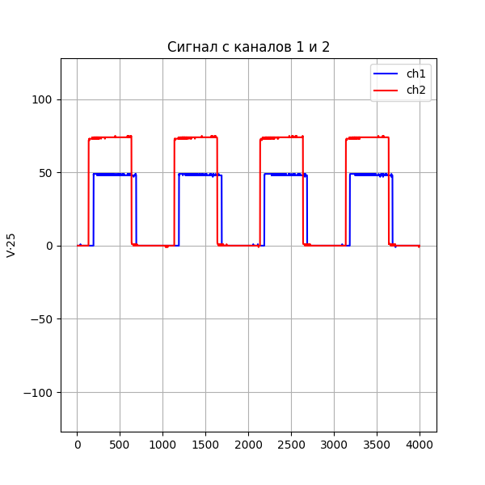
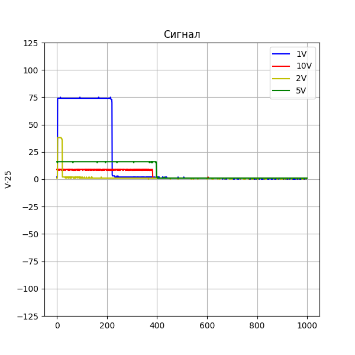

# HT6022_lib_cpp

Библиотека на С++ для работы с осциллографом Hantek HT6022BE. За основу была взята библиотека для C от [rpm2003rpm](https://github.com/rpm2003rpm/HT6022_Driver/tree/master). Сверялся с результатом от [openhantek](https://github.com/OpenHantek/OpenHantek6022).

Завернул в пространство имен `oscilloscopes` в дальнейшем возможно добавить другие осциллографы. И отдельное простаранство имен по производителя `hantek`.

**Жестко прописано под 8-битный АЦП**

## Запуск

Сборка проекта через `CMakeLists.txt`

```
cmake .
```

Запуск компиляции

```
make
```

## Графики сигналов:



Пример уровня сигналов


